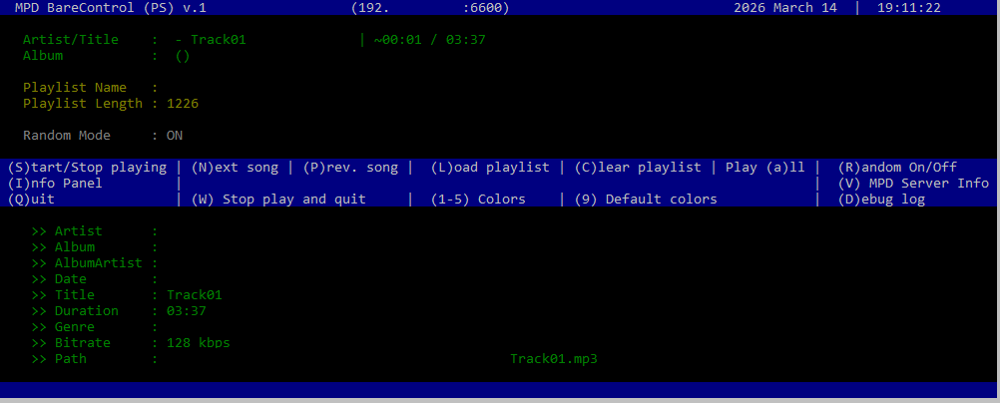
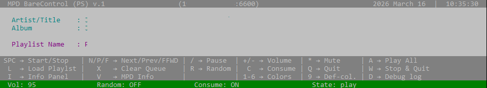

## MPD Bare Control (PS)

### Overview

* MPD Bare Control is a minimal Music Player Daemon (MPD) controller providing only the essential features.
* MPD Bare Control was written in PowerShell and utilizes a console-based user interface with keyboard function access.
* MPD Bare Control is a toy-project (as of now).
* Tested with Music Player Daemon 0.24.4 (0.24.4) running on Raspberry Pi with connections from Windows 10/11

### Installation

1. Download or clone the script:

2. Configure script

 At the top of the script, set your MPD server details:

 ```
 MPDHost = "192.165.0.1"
 MPDPort = 6600
 ```

 Optionally configure colors in `Theme` section.

3. Run it:

   ```
   c:\> mpd_control.bat
   ```

4. If PowerShell blocks execution:

   ```
   PS C:\> powershell Set-ExecutionPolicy -Scope Process -ExecutionPolicy Bypass
   ```

### Screenshots

**Full Dashboard**



**Simple Dashboard**



### Contact:

 Web    : [GitHub](https://github.com/kk-sw/MPD-Bare-Control.git)
 
 Email  : [Mail](mailto:kksw@gmx.com)

 
 
